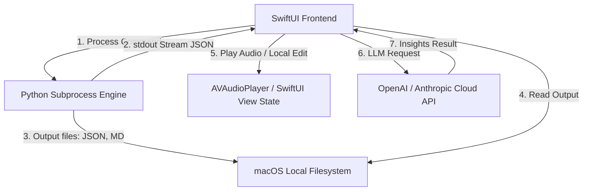

# VoiceScribe 项目架构与产品体验深度分析报告

作为具备多年系统架构与高级产品经理背景的视角，本报告对 **VoiceScribe** 本地音频转写项目在当前阶段（v1.0-BETA）的工程实现、用户体验、架构优缺点进行深度剖析，并规划出未来的迭代路线图。

---

## 1. 产品定位与核心价值分析

### 🏆 核心优势与目标受众
*   **绝对隐私与数据主权**：这是一款直击痛点的产品。对于律师、高管、机密科研人员以及政企用户来说，将会议录音上传到第三方云端服务（如讯飞、飞书妙记、ChatGPT）意味着严重的数据泄露风险。**VoiceScribe 100% 的本地处理完美锁死了数据边界。**
*   **端侧智能与 Apple Silicon 的红利**：借助 Apple M系列芯片的统一内存（Unified Memory）和高带宽，MLX 架构在端侧进行 4-bit 量化大模型推理的速度完全不亚于中小型的云端服务。本产品将这一红利直接平民化。
*   **离线与在线的优雅解耦**：本地负责重度音频转写与说话人区分，云端（LLM API）负责轻量、可高度自定义的文本摘要与多格式导出。

### ⚠️ 产品痛点与挑战
*   **“开箱即用”门槛过高**：作为一款 macOS 桌面端应用，用户期望像安装微信一样“下载即可运行”。但由于底层依赖了复杂的 Python 科学计算栈（PyTorch, MLX, ModelScope, pyannote），需要进行环境预热检测，甚至需要在系统上创建一个虚拟环境。这导致首屏的“冷启动”体验非常重。
*   **字音同步的体验割裂**：目前有“工作台”和“交互校对”两个不同的 Tab。转写完成后，用户需要手动点击“进入交互编辑器”才能进行校对，这种心智切换在快速工作的场景下显得冗长。

---

## 2. 系统技术架构评估

### 🔴 架构长处
1.  **快速集成与高可扩展性**：采用 SwiftUI 作为前端壳，通过 Python 子进程（Process）执行核心推理。这是在 AI 时代快速推出产品的最佳方案，完美复用了 HuggingFace 和 ModelScope 活跃的 Python 生态。
2.  **优雅的子进程控制**：在 [Transcriber.swift](file:///Users/sirius/Documents/Codex_Project/VibeVoiceSTT/Sources/App/Transcriber.swift) 中，通过设定 `standardInput = .nullDevice` 以及自定义的 `readabilityHandler` 监听标准输出，保证了 UI 主线程不被子进程 I/O 阻塞。
3.  **内存防崩机制**：在执行前进行可用物理内存的探测，并能根据引擎自动降档（低/中/高），能极大降低 macOS 内核 OOM 的概率。

### 🟡 架构硬伤与重构方向
1.  **基于 stdout 文本的 IPC 协议过于脆弱**：目前 Swift 与 Python 之间通过解析 stdout 的特定 JSON 行（如 `{"type": "progress"}`）来同步进度。当 Python 端依赖库抛出非预期的 Warning（例如 `PyTorch UserWarning` 或 HuggingFace 的下载日志）时，容易污染 stdout，导致 Swift 端的 JSON 解析器失效。
    *   *优化方案*：在 Python 端引入统一的 Socket 或者是 IPC Pipe 进行精细化的数据通信，将日志 stdout 与纯净的进度数据通道隔离。
2.  **Python 解释器寻址的不确定性**：依赖于用户系统上的 Python 或本地的虚拟环境（`~/.voicescribe/venv`）。一旦用户升级了 macOS 导致 Homebrew 路径变更，或者 Python 解释器损坏，软件将不可用。
    *   *优化方案*：在中期版本中，考虑将精简版的 Python 运行时和必需的 Wheel 包打包进 Application Bundle 中，实现真正零依赖的单体 App。
3.  **大模型推理依然对内存有极高要求**：虽然 M-series 芯片有统一内存，但是在 8GB 或 16GB 的低配设备上运行 Qwen3-ASR / VibeVoice 依然非常吃力，系统必须在转写过程中周期性监视和垃圾回收。

---

## 3. 高优先级的优化建议与路线图

基于当前代码基础和用户反馈，建议按照以下三个阶段进行优化升级：

### 第一阶段：体验抛光与健壮性提升 (短期 - 当前正在执行)
1.  **向导与预热机制平滑化**（已实现）：取消全就绪时的自动跳转，加入“开启 VoiceScribe”显式动作，让用户在开始前有明确的安全感去检查各项依赖状态。
2.  **交互式编辑器空间最大化**（已实现）：将原本固定宽度的双栏布局重构为 `HSplitView`，让用户可以在整理版正文与右侧的 AI 摘要面板之间自由拉扯，便于对超长文字进行比对。
3.  **真实硬件与发热状态透明化**（已实现）：引入 macOS 底层的 GPU 负载查询和发热状态检测，让用户在选择高性能档位时，能够真实看到 GPU 与散热的实时状态，建立对“本地加速”的直观信任。
4.  **无缝的多格式一键导出**（已实现）：重构空白的 `triggerExport` 占位函数，提供原生 NSSavePanel 交互，提供包含自动分页绘制的 PDF 简报、标准 Markdown、和标准的带有时间戳的 SRT 字幕导出。

### 第二阶段：环境打包与单体无缝化 (中期)
1.  **Python 捆绑打包**：使用 PyInstaller 或者是嵌入式 Python (Embedded Python) 将推理代码编译为 macOS native 的命令行工具，打包至 App 的 Resources 目录中。用户不再需要配置 Python 路径，也不需要点击“安装依赖”。
2.  **接入本地大模型 (Local LLM)**：目前摘要生成依然需要调用远程的 OpenAI/Anthropic Compatible 接口，失去了完全离线的优势。可以支持调用 macOS 本地运行的 LM Studio / Ollama 的 API，实现“转写 + 摘要”的双重完全离线。
3.  **文件交互校对与文本改写**：目前编辑器仅能用来查看文字和倍速播放音频。应支持在交互编辑器中双击直接编辑文本，并自动将修改同步回 `_整理版.md` 文件。

### 第三阶段：全自研底层与实时转写 (长期)
1.  **完全去 Python 化**：核心 ASR 引擎完全基于 Swift/Metal 重写（例如使用 `whisper.cpp` 结合 Metal，或者 MLX Swift Binding 直接加载 MLX 权重）。彻底消灭 Python 进程，将应用体积从几百 MB 缩小到几十 MB，并减少 90% 的启动开销。
2.  **实时流式转写 (Live Transcription)**：除了处理本地音频文件，支持调用系统麦克风进行实时语音听写、说话人辨识并实时呈现，直接切入本地课堂笔记和会议投屏场景。
